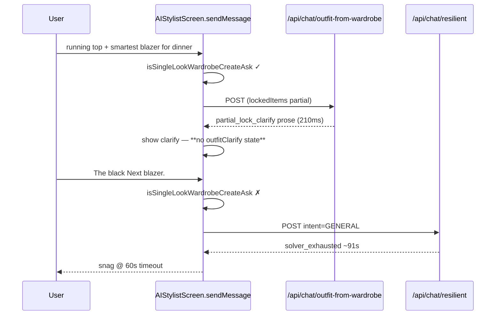
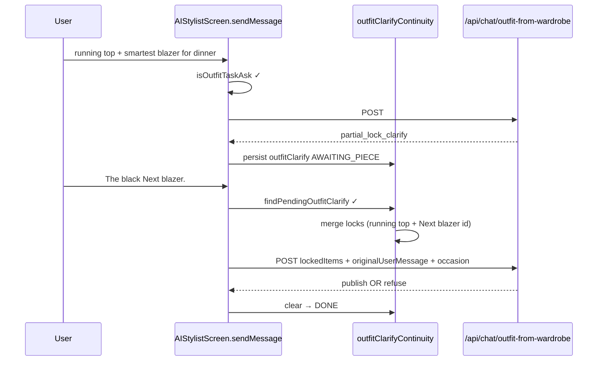

# Stylist Chat — outfit continuity routing spec (read-only)

**Status:** IMPLEMENTED (client routing + FSM) — device acceptance: Tests 3 & 4 natural wording  
**Evidence:** Test 4 RUNTIME (Render 2026-08-23); Test 3 CODE-TRACED; Test 1 RUNTIME (product issues separate)  
**Goal:** Ivy preserves a **pending outfit task** across clarification and natural short replies without regex-friendly re-prompts.

---

## Problem statement (proven)

Natural turn chain:

1. User: *“I want to wear my running top with my smartest blazer for dinner tonight. Build the outfit around those two pieces.”*
2. Ivy (210ms, `partial_lock_clarify`): *Which blazer…?*
3. User: *“The black Next blazer.”*
4. Client routes turn 3 as **GENERAL** → `/api/chat/resilient` → ~91s server / 60s client abort → generic snag.

**Root cause:** Client has **no outfit-task FSM** after `partial_lock_clarify`. Travel clarify has one (`travelClarify` + `findPendingTravelClarify`); outfit locks do not.

**Out of scope for this spec:** beam, ≥80 evaluator, metadata enrichment, duplicate detection, Live, QSC, scoring, prose templates, weather footwear gates.

---

## Canonical behavior contract

```text
initial outfit request
  → (optional) clarification question from Ivy
  → natural short answer (“The black Next blazer.”)
  → SAME pending outfit task
  → POST /api/chat/outfit-from-wardrobe (never resilient for this chain)
  → publish card OR structured refuse (solver/server copy)
```

**Invariants:**

| ID | Rule |
|----|------|
| C1 | Pending state opens on first outfit-task message OR on `partial_lock_clarify` response. |
| C2 | Pending state **survives** Ivy’s clarification message — clearing on clarify is forbidden. |
| C3 | Next user message is merged **before** cold `isSingleLookWardrobeCreateAsk` classification. |
| C4 | Short garment-only replies route to outfit endpoint when pending state is active. |
| C5 | `lockedItems` sent to server = previously resolved locks ∪ newly resolved piece(s) from short reply. |
| C6 | `originalUserMessage`, `occasion`, `weather` snapshot, and partial locks persist across clarify turn. |
| C7 | Pending state clears only on: published outfit, structured refuse/fallback from outfit endpoint, explicit user cancel (“never mind”, “cancel”, unrelated new topic per rules below), or 24h thread expiry (match travel). |
| C8 | Hard-lock natural phrasing routes to outfit endpoint **without** requiring “from my wardrobe” or repeated “build an outfit”. |

**Unrelated-topic drop (mirror travel):** If pending outfit clarify is active and user sends a clearly unrelated ask (buy/compare, multi-day travel, fashion history with no wear intent), drop pending state and route normally — log `[OutfitClarify] chat_drop_unrelated`.

---

## Before → after routing

### BEFORE (Test 4 — current)



### AFTER (target)



### ASCII summary

```text
BEFORE:
  outfit regex? ─yes→ outfit-from-wardrobe ─clarify→ (state lost)
  outfit regex? ─no──→ resilient (60s) ───────────────────→ error

AFTER:
  pending outfitClarify? ─yes→ merge reply → outfit-from-wardrobe
  isOutfitTaskAsk?       ─yes→ outfit-from-wardrobe
  else                   ───→ resilient / other (unchanged)
```

---

## Minimum changes (maps to requirements 1–7)

### 1. Persist typed pending state on `partial_lock_clarify`

**Where:** `screens/AIStylistScreen.tsx` — outfit-path success handler (~3367–3439), **after** `sendWardrobeOutfitFromChat` returns.

**Detect clarify:** `outfitResponse.path === 'partial_lock_clarify'` OR server `reason === 'partial_lock_clarify'` (already logged server-side; expose on client via existing `path` field in `ApiService.sendWardrobeOutfitFromChat` return).

**Persist on assistant `ChatMessage`:**

```typescript
outfitClarify?: {
  flow: 'outfit_lock_clarify';
  state: 'AWAITING_PIECE' | 'READY' | 'DONE';
  originalUserMessage: string;
  occasion: string;
  lockedItemIds: string[];       // resolved so far
  pendingSlot?: 'second_piece' | 'blazer' | 'garment'; // optional, cosmetic for logging
  createdAt: string;             // ISO
} | null;
```

Also mirror in `normalizeChatMessage` (~576+) and `rememberChatMessages` hydration — same pattern as `travelClarify`.

**New helper module (recommended):** `utils/outfitClarifyContinuity.ts` — parallel to `utils/multiDayTravelClarify.ts`:

| Function | Role |
|----------|------|
| `emptyOutfitClarifyState()` | Default slots |
| `findPendingOutfitClarify(messages)` | Walk back for `state !== 'DONE'` |
| `buildOutfitClarifyFromPartialLock(params)` | Create state after server clarify |
| `advanceOutfitClarify(params)` | Merge short user reply → `{ state, lockedItemIds, ready }` |
| `isOutfitClarifyReady(state)` | `lockedItemIds.length >= expectedLockCount` |
| `looksLikeOutfitClarifyCancel(text)` | User abort |
| `looksLikeUnrelatedChatDuringOutfitClarify(text)` | Drop pending (mirror travel) |

### 2. Merge next reply before intent classification

**Where:** `sendMessage` (~3193), **before** `isSingleLookWardrobeCreateAsk`:

```text
pendingOutfit = findPendingOutfitClarify(updatedMessages)
if (pendingOutfit && !looksLikeUnrelated...) {
  advanced = advanceOutfitClarify({ query: trimmedAsk, prior: pendingOutfit, wardrobeItems })
  if (advanced.state === 'READY') → force outfit-from-wardrobe path (section 3)
  if still AWAITING → second clarify message (reuse server copy tone, client-side)
}
```

`advanceOutfitClarify` uses `matchWardrobeItemsInText(trimmedAsk, wardrobeItems, 4)` from `utils/wardrobeMentionMatcher.ts` to resolve “The black Next blazer” → wardrobe id; dedupe with `lockedItemIds`.

### 3. Short reply re-enters `/api/chat/outfit-from-wardrobe`

**Where:** same block as (2) — treat as `(isSingleLookCreate || isRefineOutfitAsk || pendingOutfitReady)` for the early outfit branch (~3303).

**POST body (no server contract change required if `lockedItems` complete):**

| Field | Source |
|-------|--------|
| `userMessage` | `originalUserMessage` from pending state (frozen turn-1 ask) |
| `lockedItems` | merged ids |
| `occasion` | pending `occasion` (e.g. `evening_out`) |
| `weather` / `lat` | fresh fetch OR snapshot from turn 1 (prefer snapshot for consistency) |
| `recentOutfits` | unchanged existing logic |

Do **not** send turn-2 text alone as `userMessage` — server intent/classifiers expect the full outfit ask; locks carry the clarification answer.

### 4. Previously resolved locks survive clarification

**Turn 1 client already computes partial locks** (~3356–3365):

```3356:3365:screens/AIStylistScreen.tsx
        const dualGarmentAsk = /\b(\w+\s+){0,3}(top|blazer|shirt|tee|tank)\b.{0,16}\b(and|with)\b/i.test(trimmedAsk);
        const mentionMatches = !isRefineOutfitAsk
          ? matchWardrobeItemsInText(trimmedAsk, wardrobeItems, 4)
          : [];
        const mentionLockIds = [...new Set(mentionMatches.map((m) => String(m.id)).filter(Boolean))];
        if (dualGarmentAsk && mentionLockIds.length >= 2 && !lockedItems?.length) {
          lockedItems = mentionLockIds.slice(0, 2);
        } else if (mentionLockIds.length && /\b(build around|wear my|using my|with my)\b/i.test(trimmedAsk)) {
          lockedItems = mentionLockIds;
        }
```

**Spec:** When building `outfitClarify`, persist `lockedItemIds = lockedItems ?? mentionLockIds` from turn 1 even when server returns `partial_lock_clarify` (server could not crown outfit yet; client still knows partial resolution).

### 5. Hard-lock natural phrasing → outfit endpoint

**Where:** extend routing gate — new `isOutfitTaskAsk(text)` in `utils/outfitClarifyContinuity.ts` (or `utils/outfitTaskRouting.ts`), called from `sendMessage` instead of relying solely on `isSingleLookWardrobeCreateAsk`.

**Keep** existing `isSingleLookWardrobeCreateAsk` patterns; **add** (non-exhaustive):

| Pattern class | Example | Notes |
|---------------|---------|-------|
| Wear-my hero | “I definitely want to wear my …” | Test 3 |
| Build-around without “outfit” | “Build the rest around it/that/this.” | Natural hard lock |
| Put together around | “Put together something around this shirt.” | |
| Hero + occasion | “wear my X tonight / this afternoon / to dinner” | |

**Explicitly do NOT require:** “from my wardrobe”, repeated “build an outfit” on clarify follow-up.

Replace outfit branch condition (~3303):

```text
(isOutfitTaskAsk(trimmedAsk) || isRefineOutfitAsk || pendingOutfitReady) && !attachedUris.length
```

where `isOutfitTaskAsk` = `isSingleLookWardrobeCreateAsk(t) || isWardrobeHardLockAsk(t)`.

### 6. Pending state lifecycle

| Event | `outfitClarify.state` |
|-------|------------------------|
| Server `partial_lock_clarify` | `AWAITING_PIECE` |
| Short reply resolves all locks | `READY` → immediate outfit POST → `DONE` |
| Published outfit / structured refuse from outfit endpoint | `DONE` (clear) |
| User cancel phrase | `DONE` (clear) |
| Unrelated new topic | cleared + log |
| Ivy asks clarify | **stay** `AWAITING_PIECE` — **never clear** |

### 7. Explicit non-goals (frozen territory)

No edits to: server beam/evaluator, `createWardrobeOutfit` scoring, duplicate detection, Live published snapshot, QSC, `buildDeterministicOutfitExplain`, allocator metadata pipelines.

**Client-only** routing + state + POST field assembly. Server may already honour complete `lockedItems`; if turn-2 still fails with full locks, that's solver/refuse behaviour (Test 4 clash) — separate from routing spec.

---

## Files and functions (exact touch list)

| File | Function / area | Change |
|------|-----------------|--------|
| **`utils/outfitClarifyContinuity.ts`** | **NEW** | FSM + merge + hard-lock routing helpers |
| **`utils/outfitClarifyContinuity.test.ts`** or **`scripts/verify-outfit-continuity-routing.ts`** | **NEW** | Turn-chain fixtures (below) |
| **`screens/AIStylistScreen.tsx`** | `ChatMessage` type (~264) | Add `outfitClarify?` |
| | `normalizeChatMessage` (~576) | Persist/restore `outfitClarify` |
| | `sendMessage` (~3193–3440) | Pending check **before** regex; clarify persist **after** outfit POST; widen outfit branch guard |
| | `findPendingTravelClarify` (~370) | Add sibling `findPendingOutfitClarify` call |
| **`services/ApiService.ts`** | `sendWardrobeOutfitFromChat` (~2328) | **No contract change**; optionally log `path`/`reason` in `__DEV__` |
| **`utils/wardrobeMentionMatcher.ts`** | `matchWardrobeItemsInText` | **Read-only reuse** — no change required |
| **`utils/multiDayTravelClarify.ts`** | — | **Reference only** — mirror pattern, do not merge FSMs |

**Not touched:** `utils/wardrobeAllocationEngine.ts`, `utils/buildDeterministicOutfitExplain.ts`, `utils/wardrobeDuplicateMatch.ts`, `contexts/WardrobeContext.tsx` (except existing display imports), Dripn-Server solver files.

---

## Turn-chain fixtures (deterministic — natural wording)

Add to `scripts/verify-outfit-continuity-routing.ts`. Pure client routing assertions — **no API mocks required** for classification; optional integration later.

### Fixture A — Test 4 class (clarify continuity)

| Step | User text | Expected route |
|------|-----------|----------------|
| A1 | `I want to wear my running top with my smartest blazer for dinner tonight. Build the outfit around those two pieces.` | `outfit-from-wardrobe` |
| A2 | *(simulate server response path `partial_lock_clarify`)* | `outfitClarify.state === AWAITING_PIECE`, original message stored |
| A3 | `The black Next blazer.` | **`outfit-from-wardrobe`** (not resilient), merged locks ≥ 1 new id, `userMessage === A1` |

### Fixture B — Test 3 class (hard lock, no clarify)

| Step | User text | Expected route |
|------|-----------|----------------|
| B1 | `I definitely want to wear my chambray shirt. Build the rest around it.` | `outfit-from-wardrobe` via `isWardrobeHardLockAsk` |

### Fixture C — unrelated drop

| Step | User text | Expected |
|------|-----------|----------|
| C1 | *(pending AWAITING_PIECE)* | — |
| C2 | `Who invented the little black dress?` | pending cleared; **not** outfit POST |

### Fixture D — cancel

| Step | User text | Expected |
|------|-----------|----------|
| D1 | *(pending AWAITING_PIECE)* | — |
| D2 | `Never mind, different question.` | pending cleared |

### Fixture E — refine still works

| Step | User text | Expected |
|------|-----------|----------|
| E1 | *(prior assistant message with outfitSuggestion)* | — |
| E2 | `Keep the shoes but change the top and bottoms` | `outfit-from-wardrobe` refine (existing `isWardrobeOutfitRefineAsk`) |

---

## 60s client vs 91s server — separate budget issue

**Why it happens today:**

| Layer | Budget | Test 4 T2 behaviour |
|-------|--------|---------------------|
| Client `sendStylistMessage` | `timeout: 60000` (~2237–2241 `ApiService.ts`) | Aborts fetch ~60s → catch → generic “hit a snag” |
| Server unified resilient pipeline | No matching client deadline | Continues critique loop → `COMPATIBILITY_GUARD_DONE` at **90,855ms** |

Client abort **does not cancel** server work (no shared `AbortSignal` propagation to Render; server unaware client left).

**Do not fix by:** raising resilient timeout to 90s+ for all chat.

**Proposed alignment (implementation phase 2 — separate from continuity spec):**

1. **Prevention (primary):** Outfit pending chains never enter resilient — removes Test 4 class entirely.
2. **Abort propagation:** Pass `AbortSignal` from client timeout to `fetch`; document that server may still finish but client ignores late response (idempotent).
3. **Server budget cap:** Unified pipeline max wall clock for `requiresOutfit` when `lockedItems` absent and intent ambiguous — fail fast → structured refuse at ≤15s (server change; optional, not blocking client continuity).
4. **Late response guard:** Client ignores responses where `message.id` / turn token ≠ active send generation.

Continuity spec **alone** addresses (1) for clarify/hard-lock chains. Timeout alignment remains a **follow-up ticket** if any outfit-adjacent path still hits resilient.

---

## Validation plan (after one bounded implementation)

1. **No regex-friendly rewording** — exact natural phrases from Tests 3–4.
2. Re-run **Test 3** and **Test 4** only in a fresh thread.
3. Render expectations:
   - Test 4 T2: `[OutfitFromWardrobe]` or `[ChatWardrobeOutfit]` — **not** `[ResilientChat]` for the short blazer reply.
4. If Test 4 publishes athletic+dinner clash → evaluate **refuse copy** (solver/product); routing PASS is separate.
5. Continue Tests **5–7** if 3–4 route correctly.
6. **Do not rerun** Test 1 or Test 2 (yesterday) — frozen baseline.
7. Test 2 today remains **parked** until after routing validation.

---

## Parked (not blockers for this spec)

| Item | Class | Action |
|------|-------|--------|
| Test 2 today ~14:27 refuse | Unclassified solver failure | One Render line when convenient |
| Test 1 wellies | Weather footwear product | Stylist quality pass after Generalised 7 |
| Test 1/2 prose templates | Phase 1 presentation | Same pass |
| Server 26s solve | Latency debt | Measure one pipeline after routing stable |

---

## Implementation gate

**Approve this spec → single PR scoped to:**

- `utils/outfitClarifyContinuity.ts` (+ tests/fixtures)
- `screens/AIStylistScreen.tsx` routing/state only

**Reject if PR touches:** evaluator, beam, duplicate matcher, prose templates, server solver scoring.
